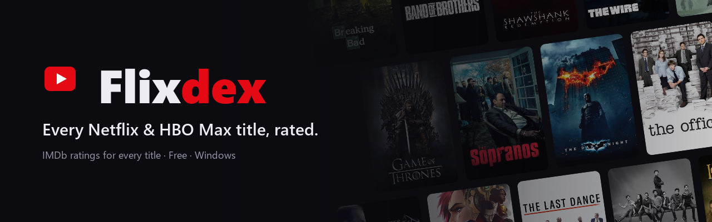
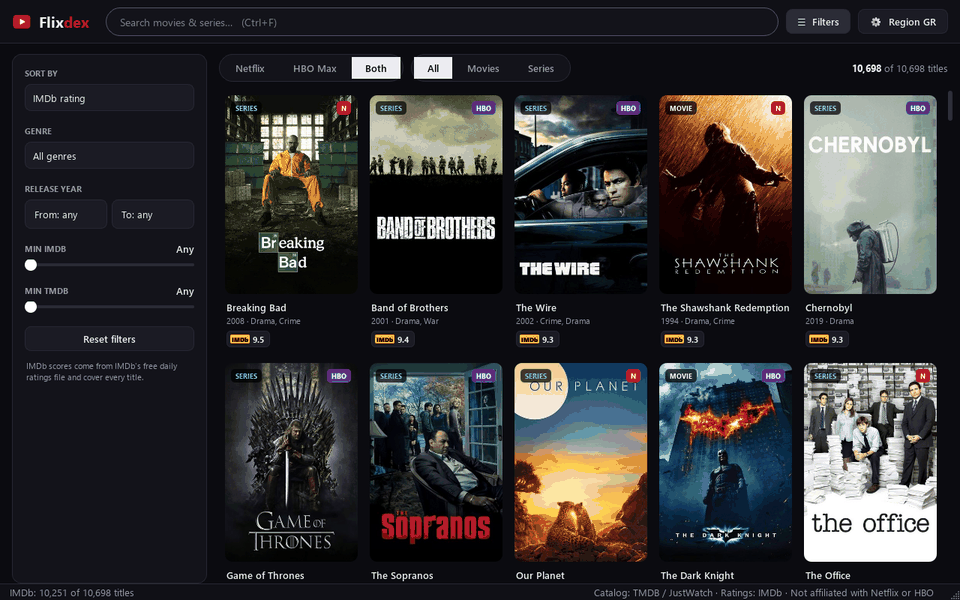
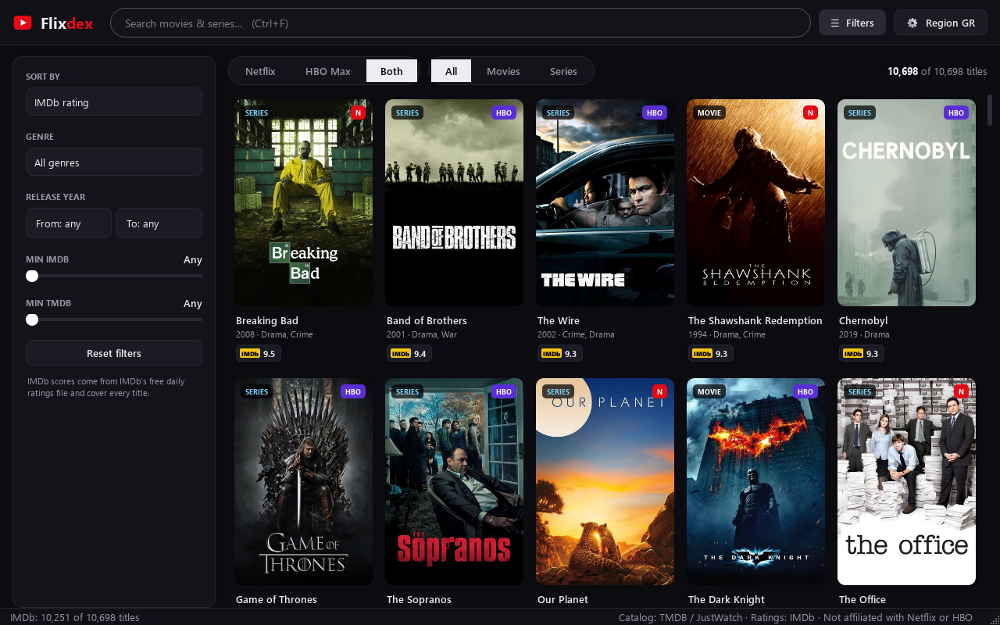
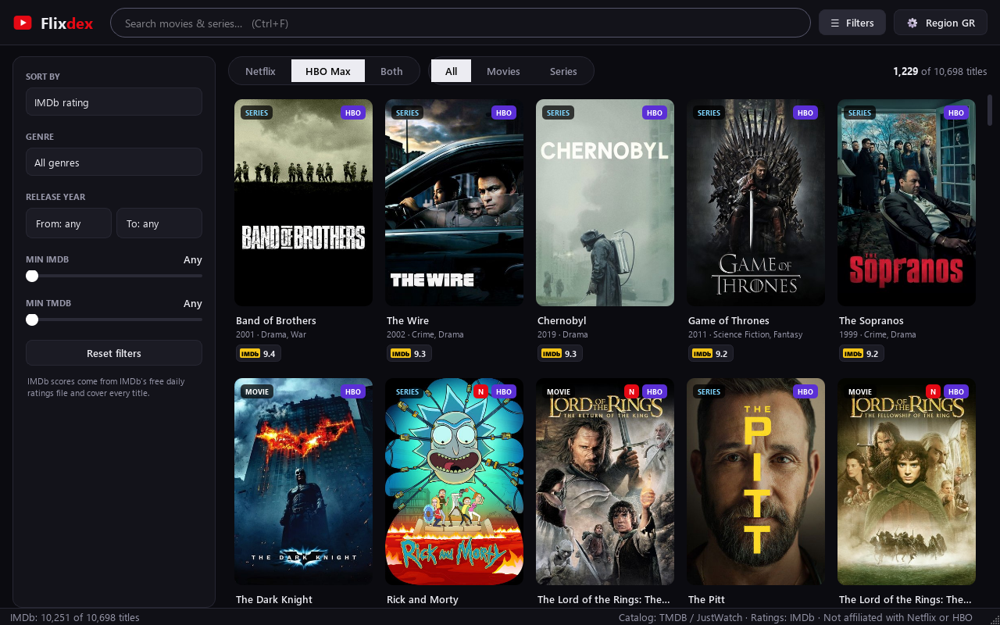
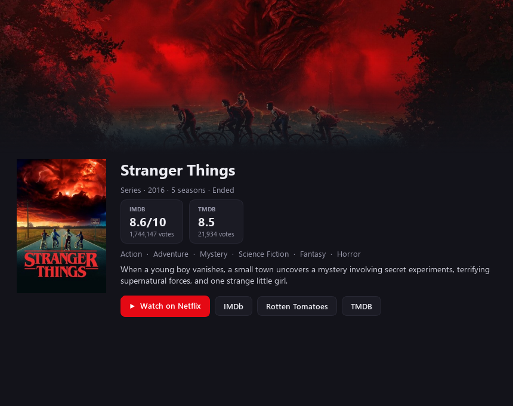

<p align="center">
  
</p>

<p align="center">
  <a href="https://github.com/Turnedone/flixdex/releases/latest"></a>
  <a href="https://github.com/Turnedone/flixdex/releases"></a>
  
  <a href="LICENSE"></a>
</p>

<p align="center">
  <b>What should I watch tonight?</b> Flixdex shows everything that's streaming on <b>Netflix</b> and <b>HBO Max</b> in your country,<br>
  with the <b>IMDb rating</b> of every movie and series, so the good stuff is always one click away.
</p>

<p align="center">
  <a href="https://github.com/Turnedone/flixdex/releases/latest/download/Flixdex.exe"><b>⬇ Download Flixdex for Windows</b></a>
  &nbsp;·&nbsp; free · no install · no account
</p>

<p align="center">
  
</p>

## Why Flixdex?

Netflix and HBO Max don't show IMDb ratings, and their apps make it hard to see *everything* that's available.
Flixdex puts the whole catalog in one fast window and lets you sort it by what people actually think of it.

- 🎬 **The full catalog** for your country, for Netflix, HBO Max, or both at once
- ⭐ **IMDb rating and vote count** for every movie and series, updated daily
- 🔎 **Instant search** plus filters for genre, release year and minimum rating
- ↕️ **Sort** by IMDb rating, popularity, release date or title
- ▶️ **One click to watch**: opens the title straight on Netflix or HBO Max in your browser
- 🪶 **Light and private**: a single `.exe`, no account, no tracking; everything stays on your PC

## Screenshots

| Both services, sorted by IMDb | HBO Max only |
|:---:|:---:|
|  |  |

<p align="center">
  
</p>

## Getting started

1. **[Download `Flixdex.exe`](https://github.com/Turnedone/flixdex/releases/latest/download/Flixdex.exe)** and run it.
2. Get a **free TMDB API key** at [themoviedb.org/settings/api](https://www.themoviedb.org/settings/api). It takes about two minutes.
   The form asks for an *Application URL*; `http://localhost` is fine for personal use.
3. Paste the key into Flixdex, choose your country, and you're done.

The first start takes a few minutes while Flixdex downloads the catalogs and IMDb's ratings. After that, it opens instantly.

> **"Windows protected your PC"?** Flixdex isn't code-signed (certificates are expensive for a free hobby project),
> so SmartScreen warns about it the first time. Click **More info → Run anyway**. You can also [build it yourself](#build-from-source) from the source.

## FAQ

<details>
<summary><b>Is it free? Do I need a Netflix or HBO account?</b></summary>

Yes, it's free and open source. You don't need a streaming account to browse. You only need one to actually watch, and the *Watch* button simply opens the title on the service's website.
</details>

<details>
<summary><b>Which countries work?</b></summary>

Any country where TMDB/JustWatch track Netflix or HBO Max (most of them). Pick yours in **Settings**. If HBO Max isn't available where you live, the HBO Max view is simply empty.
</details>

<details>
<summary><b>Why is a title missing, or showing the wrong service?</b></summary>

Availability comes from JustWatch via TMDB, refreshed once a day. Catalogs change all the time, so a title can be a day out of date. **Settings → Refresh catalog** forces an update.
</details>

<details>
<summary><b>Why does a title have no IMDb rating?</b></summary>

A few, mostly very new or obscure titles, aren't linked to IMDb on TMDB yet. Flixdex re-checks them weekly.
</details>

<details>
<summary><b>Are there any usage limits?</b></summary>

No. Flixdex only uses sources without a daily quota (see below), and it saves everything it fetches so it rarely asks twice.
</details>

<details>
<summary><b>Where is my data stored?</b></summary>

In `%APPDATA%\Flixdex` on your PC: your TMDB key, your filters and the cached catalogs. Nothing is sent anywhere except the requests to the data sources below. To remove everything, delete that folder and `Flixdex.exe`.
</details>

## Where the data comes from

| What | Source | Key needed |
|---|---|---|
| Catalog, posters, genres | [TMDB](https://www.themoviedb.org), with streaming availability by [JustWatch](https://www.justwatch.com) | Free TMDB key, no daily cap |
| IMDb ratings | [IMDb's ratings dataset](https://developer.imdb.com/non-commercial-datasets/), downloaded once a day (~9 MB) | None |
| Direct Netflix / HBO Max links | [Wikidata](https://www.wikidata.org) | None |

## Build from source

Requires Windows and Python 3.11+.

```bat
git clone https://github.com/Turnedone/flixdex.git
cd flixdex
build.bat
```

`build.bat` sets up a `.venv` with PySide6 and PyInstaller on first run and writes `dist\Flixdex.exe`.
To run from source instead: `run.bat` (after `build.bat`), or `pip install -r requirements.txt` and `python flixdex.py`.

The whole app is a single file, [`flixdex.py`](flixdex.py). [`tools/make_media.py`](tools/make_media.py) regenerates the screenshots and demo in `docs/`.

## Contributing

Bug reports and ideas are welcome: [open an issue](https://github.com/Turnedone/flixdex/issues/new/choose).
Pull requests are welcome too. For bigger changes, please open an issue first so we can talk it through.

## Credits

- This product uses the TMDB API but is not endorsed or certified by TMDB. Streaming availability data by JustWatch.
- IMDb ratings: information courtesy of IMDb ([imdb.com](https://www.imdb.com)), used with permission for personal and non-commercial use.
- Streaming links from Wikidata ([CC0](https://creativecommons.org/publicdomain/zero/1.0/)).
- Flixdex is not affiliated with Netflix, HBO, Warner Bros. Discovery, IMDb or Amazon.

## License

The code is [MIT licensed](LICENSE). The data sources above have their own terms.
